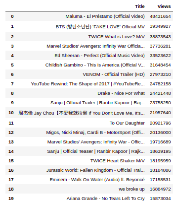

# Explore the top trending YouTube videos from November 2017 - June 2018
Given the video title, category, publish time, tags, views, likes, dislikes, and comment count, explore  the factors that contribute to videos trending. 

## Background
The YouTube trending videos page provides a platform for small and large content creators to have their videos reach a broader audience. Having your video listed on this page provides higher visibility and potential for channel growth. This ultimately allows the content creator to generate more revenue and strengthen their brand value.

## Data 
The dataset was found on <a href=https://www.kaggle.com/datasnaek/youtube-new> Kaggle </a>, it includes seven months of data on daily trending YouTube vidoes for the US and other countries. The original csv includes video title, channel title, publish time, tags, views, likes and dislikes, description, and comment count. I loaded the data into a SQLite3 database (using sql was a requirement) and normalized with the following schema:

 
 ## EDA
### Trending videos with most views:

### Videos with most likes:

### Most frequent words in tags:

### Most frequent words in titles:

### Number of videos by category:

### Barchart race of top videos by view count over the period
Embedded videos are not supported, video hosted on <a href=https://streamable.com/58nl42> streamable </a>
The barchart of the top videos from the final day in the dataset:
